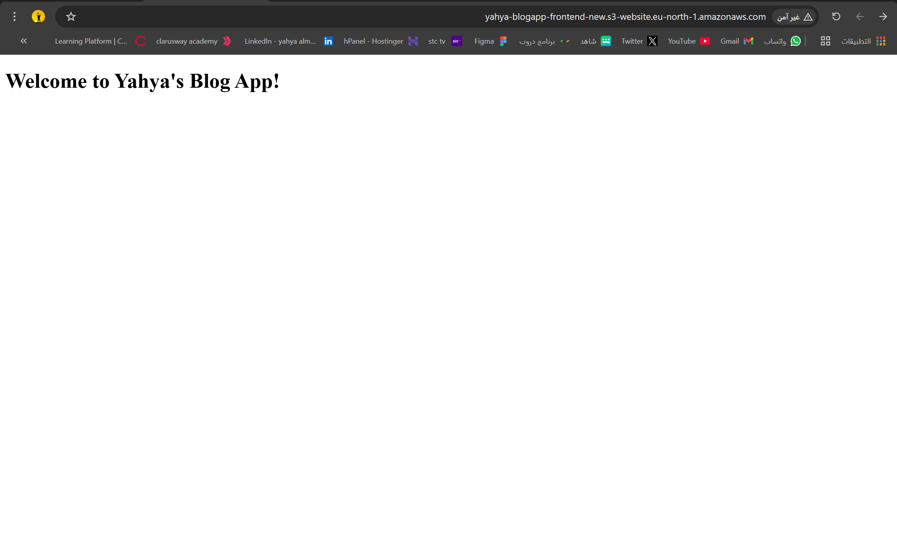

# MERN Stack Blog App Deployment with Terraform and Ansible

This project demonstrates the deployment of a simple MERN (MongoDB, Express, React, Node.js) blog application using *Terraform* and *Ansible* on *AWS* infrastructure.

## Project Objectives

- Deploy a static frontend to an S3 bucket with public access.
- Provision two backend EC2 instances using Terraform.
- Configure backend servers with Node.js and Git using Ansible.
- Clone the backend app from GitHub and launch it.
- Set up an IAM user with permissions to upload media to an S3 bucket.

---

## Architecture Overview

+-----------------------------+
                         |         S3 Bucket           |
                         |     Static Frontend HTML    |
                         +-------------+---------------+
                                       |
                                       v
                                       +—————––+             +—————––+             +—————––+
|  EC2 Instance #1  | <———  |   (Future: ALB)   |  ———> |  EC2 Instance #2  |
|  Backend Server   |             | Load Balancer     |             |  Backend Server   |
+—————––+             +—————––+             +—————––+
|
                                       v
                         S3 Bucket for Media Uploads via IAM User

---

---

## Technologies Used

- *Terraform*: Infrastructure as Code (IaC) to provision AWS resources.
- *Ansible*: Configuration management to automate software installation and setup.
- *Amazon EC2*: Hosts the backend Node.js app.
- *Amazon S3*: Hosts static frontend and media uploads.
- *IAM*: Controls secure access to the media bucket.

---

## Project Structure

```bash
mern-blogapp-deploy/
├── Frontend/
│   └── index.html
├── Backend.tf
├── Main.tf
├── IAM.tf
├── inventory.yml
├── backend-playbook.yml
└── variables.tf

Setup Instructions

1. Prerequisites

Ensure you have the following installed:
	•	AWS CLI
	•	Terraform
	•	Ansible
	•	SSH Key pair uploaded to AWS (used by EC2 instances)

⸻

2. Frontend Deployment (S3)

Uncomment the S3 frontend block in Main.tf to create:
	•	A public S3 bucket to host index.html
	•	Bucket ownership controls
	•	Public read access policy
	•	Upload index.html via Terraform using aws_s3_object

    terraform init
terraform apply

Screenshots:

- .png)
- 

3. Backend Deployment (EC2 Instances)

In Backend.tf, Terraform will:
	•	Fetch default VPC, subnets, and security groups
	•	Launch two EC2 instances with public IPs
	•	Tag them accordingly

    terraform apply -target=aws_instance.backend_1
terraform apply -target=aws_instance.backend_2

Screenshot:

- 

4. IAM Setup for Media Uploads

The IAM.tf file:
	•	Creates an IAM user with a custom policy
	•	Grants access to upload files to yahya-blogapp-media-new S3 bucket

    terraform apply -target=aws_iam_user.media_user
terraform apply -target=aws_iam_access_key.media_user_key

You will get AccessKey and SecretKey for use in the frontend upload functionality.

Screenshots:

- 
- 

5. Backend Configuration with Ansible

After Terraform provisions EC2 instances, use inventory.yml and backend-playbook.yml:

ansible-playbook -i inventory.yml backend-playbook.yml

This will:
	•	Install Node.js and Git
	•	Clone the backend repo
	•	Install dependencies
	•	Start the app using nohup

    Notes
	•	You can improve the backend by adding a Load Balancer and Auto Scaling Group.
	•	MongoDB is expected to be managed externally (e.g., MongoDB Atlas).
	•	The backend runs directly using nohup, not a process manager like PM2 or systemd.

    To-Do (Future Improvements)
	•	Integrate MongoDB Atlas or EC2-hosted MongoDB
	•	Use PM2 for better Node.js process management
	•	Add HTTPS and domain configuration via Route53 and ACM
	•	Add health checks and monitoring

    ## Notes

- *MongoDB:*  
  This project assumes an external MongoDB service such as *MongoDB Atlas*. The backend app connects to MongoDB remotely. MongoDB installation or hosting is outside the scope of this deployment.

- The backend app runs with nohup, not managed by PM2 or systemd.
- Future improvements include adding Load Balancer, Auto Scaling Group, HTTPS with ACM, and process management.

## Terraform Execution Screenshots

- 
- 


    Author
Yahya Almalki.
GitHub: @YHKH